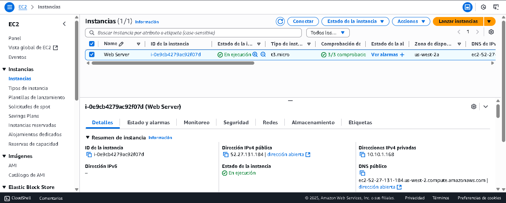
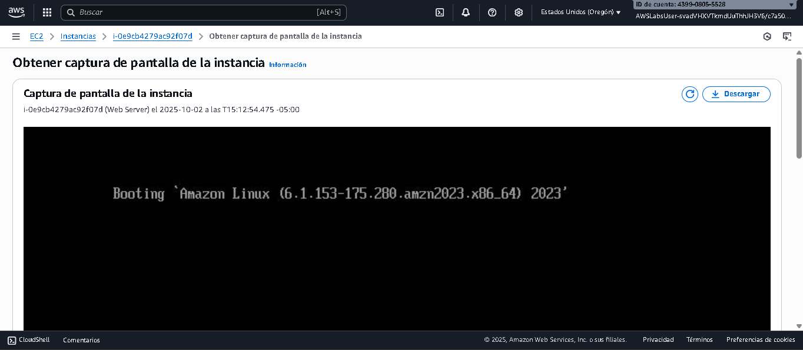
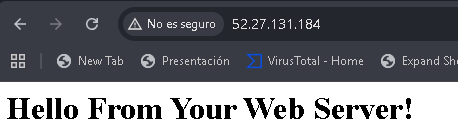
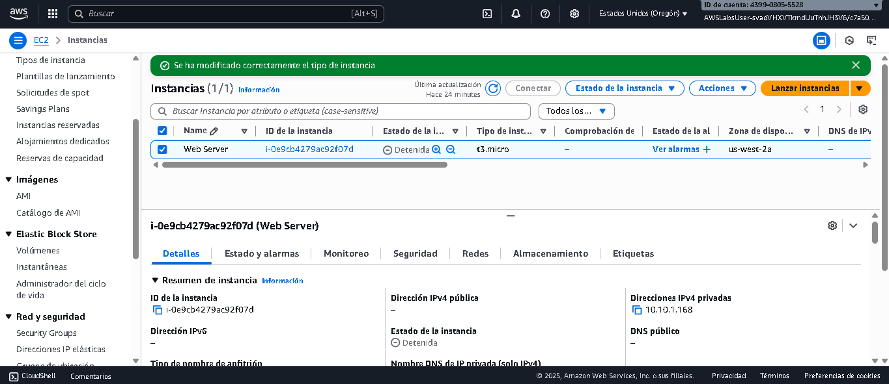
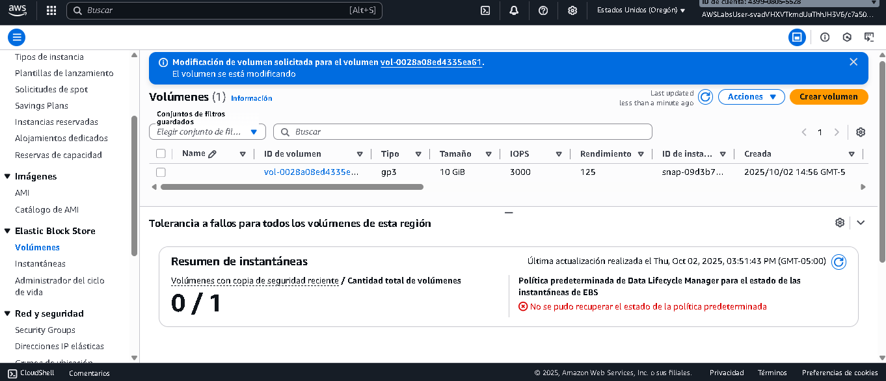

# AWS Lab 2: Amazon EC2 – Lanzamiento y Gestión de una Instancia

**Plataforma:** AWS Skill Builder Labs  
**Fecha:** 2025-10-01  
**Nivel:** Básico / Intermedio  
**Duración estimada:** 1 hora  

---

## 🎯 Objetivos del laboratorio
Al finalizar este laboratorio, podrá realizar lo siguiente:

- Iniciar un servidor web con **protección contra terminación** habilitada.  
- Supervisar la instancia de EC2.  
- Modificar el grupo de seguridad para permitir tráfico HTTP.  
- Cambiar el tipo de instancia y el tamaño del volumen de EBS.  
- Probar la protección contra terminación.  
- Terminar la instancia de EC2.  

---

## 📝 Tarea 1: Lanzar una instancia de Amazon EC2

1. En la consola de AWS, buscar **EC2** y seleccionar **Lanzar instancia**.  
2. Nombre: `Web Server`.  
3. AMI: **Amazon Linux 2023** (requerida para este laboratorio).  
4. Tipo de instancia: `t3.micro` (2 vCPU, 1 GiB RAM).  
5. Par de claves: *sin par de claves* (no requerido para este lab).  
6. Configuración de red:  
   - VPC: `Lab VPC`.  
   - Subred: `Public Subnet 1`.  
   - Grupo de seguridad: `Web Server security group`.  
7. Almacenamiento: volumen raíz por defecto de **8 GiB**.  
8. Protección contra terminación: **habilitada**.  
9. Datos de usuario (user data):  



```bash
#!/bin/bash
dnf -y install httpd
systemctl enable httpd
systemctl start httpd
echo '<html><h1>Hello From Your Web Server!</h1></html>' > /var/www/html/index.

## 📝 Tarea 2: Supervisar la instancia

El monitoreo es esencial para mantener el rendimiento, la disponibilidad y la fiabilidad de las instancias de Amazon EC2.

1. En la consola, seleccionar la pestaña **Estado y alarmas**.  
   - Verificar que las comprobaciones de:
     - Accesibilidad del sistema  
     - Accesibilidad de la instancia  
     - Accesibilidad de EBS  
   hayan sido **aprobadas**.

2. Ir a la pestaña **Supervisión**.  
   - Observar las métricas básicas enviadas a **CloudWatch** (cada 5 minutos por defecto).  
   - Ampliar gráficos si es necesario.  

3. En el menú superior **Acciones → Monitoreo y solución de problemas → Obtener registro del sistema**.  
   - Revisar el **System Log** para confirmar que el script de *user data* ejecutó la instalación de `httpd`.  
   - Si no aparece el log, esperar unos minutos y volver a actualizar.  

4. Obtener una **captura de pantalla de la instancia** desde el menú de acciones.

📷 

---

## 📝 Tarea 3: Actualizar el grupo de seguridad y acceder al servidor web

1. Seleccionar la instancia y copiar la dirección **IPv4 pública**.  
2. Intentar acceder en el navegador:  
http://<public-ip>

markdown
Copiar código
→ No hay acceso, ya que el grupo de seguridad no permite tráfico HTTP (puerto 80).  

3. Solución:  
- Ir a **Grupos de seguridad**.  
- Seleccionar `Web Server security group`.  
- En **Reglas de entrada**, elegir **Editar reglas**.  
- Agregar:  
  - Tipo: **HTTP**  
  - Fuente: **Anywhere-IPv4 (0.0.0.0/0)**  

4. Guardar cambios.  
5. Regresar al navegador y actualizar la página.  

✅ **Resultado esperado:**  
Hello From Your Web Server!

markdown
Copiar código

📷 **Captura:** navegador mostrando la página web desplegada desde Apache.


---

## 📝 Tarea 4: Modificar el tamaño de la instancia

### 🔹 Detener la instancia
1. Seleccionar la instancia.  
2. Menú **Estado de la instancia → Detener instancia**.  
3. Confirmar → esperar hasta que muestre estado **Detenida**.  

### 🔹 Cambiar tipo de instancia
1. Con la instancia detenida:  
   - **Acciones → Configuración de instancia → Cambiar tipo de instancia**.  
   - Nuevo tipo: `t3.small`.  
   - Guardar cambios.  

### 🔹 Modificar volumen EBS
1. En el panel izquierdo, ir a **Elastic Block Store → Volúmenes**.  
2. Seleccionar el volumen asociado.  
3. Menú **Acciones → Modificar volumen**.  
4. Cambiar de **8 GiB → 10 GiB**.  
5. Confirmar → esperar hasta que el estado pase de `Modifying → Optimizing → Complete`.  

### 🔹 Reiniciar la instancia
1. Regresar a **Instancias**.  
2. Seleccionar `Web Server`.  
3. **Estado de instancia → Iniciar instancia**.  

📷 **Captura:** consola mostrando instancia en `t3.small` con volumen raíz de 10 GiB.



---

## ✅ Resultado final

- Instancia EC2 desplegada con Apache y página de prueba.  
- Supervisión confirmada vía **CloudWatch** y **System Log**.  
- Grupo de seguridad actualizado para permitir HTTP.  
- Tipo de instancia cambiado de `t3.micro` → `t3.small`.  
- Volumen raíz expandido de **8 GiB → 10 GiB**.  

---