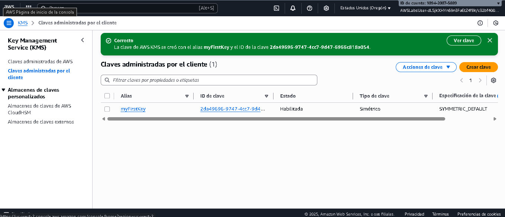
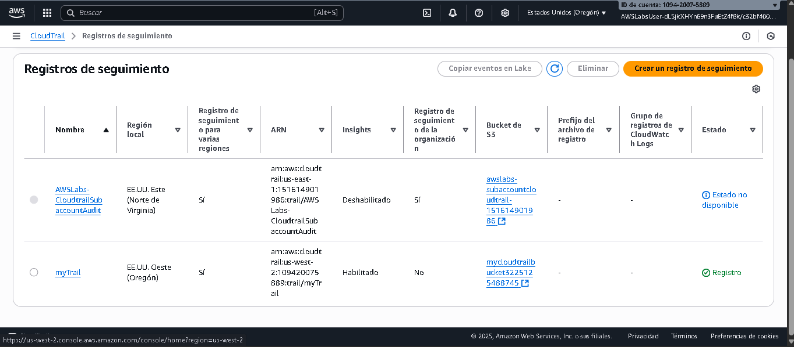
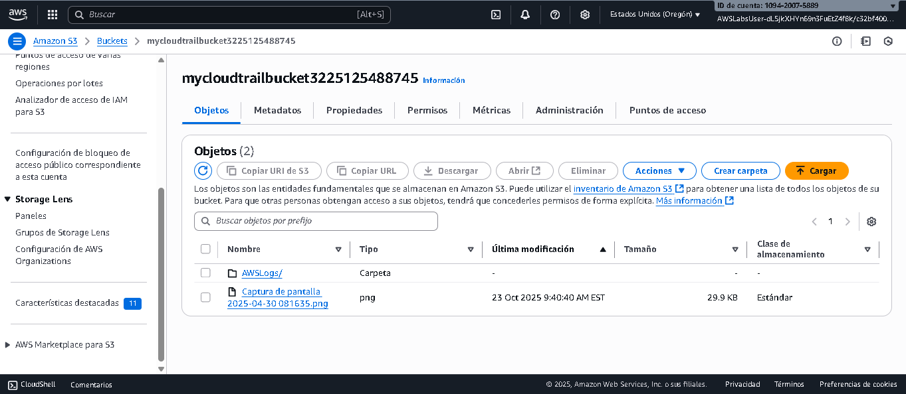

# Introduction to AWS Key Management Service (KMS)

## 🎯 Objetivos
Después de completar este Caso, sabrás cómo realizar lo siguiente:

- Crear una clave maestra de KMS (Key Management Service).  
- Configurar AWS CloudTrail para almacenar registros en un bucket de S3.  
- Subir y cifrar objetos en S3 usando claves KMS.  
- Probar acceso a objetos cifrados y entender la seguridad de SSE-KMS.  
- Administrar usuarios y roles que pueden usar claves de KMS.

---

## 🧠 Escenario del Caso
Tu empresa desea mejorar la seguridad de los datos almacenados en Amazon S3. Para ello, se implementará cifrado administrado con AWS KMS y auditorías de CloudTrail.  
Aprenderás a crear claves KMS, cifrar objetos en S3 y administrar permisos sobre dichas claves.

---

## 🗝️ Tarea 1: Crear tu clave maestra de KMS

En esta tarea, crearás una **clave maestra (Customer Managed Key)** en AWS KMS para proteger datos en S3.

1. En la barra superior de AWS Console, busca **Key Management Service** y selecciónalo.  
2. Elige **Crear una clave**.  
3. En la página **Configurar clave**, selecciona **Simétrica** → **Siguiente**.  
4. En **Agregar etiquetas**, configura:  
   - **Alias:** `myFirstKey`  
   - **Descripción:** `KMS Key for S3 data`  
5. En **Definir permisos de administración**, selecciona tu usuario actual (`AWSLabsUser-xxxx`).  
6. En **Definir permisos de uso**, selecciona el mismo usuario.  
7. Revisa los parámetros y haz clic en **Finalizar**.

📸 *Captura sugerida:* 

> **Nota:** Copia el **Key ID** (ID de clave) mostrado en la tabla. Lo usarás más adelante para revisar eventos en CloudTrail.

---

## ☁️ Tarea 2: Configurar CloudTrail para almacenar registros en un bucket de S3 nuevo

CloudTrail te permite registrar todas las acciones de API que se realizan en tu cuenta de AWS.

1. En la barra superior, busca **CloudTrail** y selecciónalo.  
2. En el panel izquierdo, elige **Trails (Registros de seguimiento)** → **Crear un registro de seguimiento**.  
3. Configura:
   - **Nombre del trail:** `myTrail`  
   - **Bucket S3:** `mycloudtrailbucketNUMBER` *(reemplaza NUMBER por un número aleatorio)*  
   - Desactiva **Cifrado SSE-KMS para archivo de registro**.  
   - Haz clic en **Siguiente**.
4. En **Elegir eventos de registro**, selecciona:
   - ✅ Eventos de administración  
   - ✅ Eventos de datos  
   - ✅ Eventos de Insights  
5. En **Eventos de Insights**, marca:
   - Tasa de llamadas a la API  
   - Tasa de error de la API  
6. Revisa la configuración y selecciona **Crear un registro de seguimiento**.

📸 *Captura sugerida:* 

> CloudTrail empezará a registrar actividad, incluyendo el uso de tu clave KMS.

---

## 🪣 Tarea 3: Subir una imagen a tu bucket de S3 y cifrarla

En esta tarea, cargarás un archivo y lo cifrarás con tu clave KMS.

1. Busca **S3** desde la barra superior.  
2. Abre el bucket `mycloudtrailbucket*`.  
3. En la pestaña **Objetos**, selecciona **Cargar** → **Agregar archivos**.  
4. Selecciona una imagen de tu equipo.  
5. Desplázate a **Propiedades** → **Configuración del cifrado del lado del servidor**.  
6. Activa **Invalidar configuración del bucket para el cifrado predeterminado**.  
7. En **Tipo de cifrado**, selecciona:
   - **Server-side encryption with AWS KMS keys (SSE-KMS)**.  
   - Luego elige **Elija entre sus claves de AWS KMS** → selecciona `myFirstKey`.
8. Haz clic en **Cargar** → **Cerrar**.

📸 *Captura sugerida:* 

> Anota la **marca de tiempo “Última modificación”**. La usarás para verificar los eventos de CloudTrail.

---

## 🔐 Tarea 4: Acceder a la imagen cifrada

1. En la pestaña **Objetos**, selecciona el nombre de la imagen → **Abrir**.  
   - La imagen se abrirá correctamente porque tienes permisos de descifrado vía KMS.  
2. Copia la **URL del objeto** y pégala en un navegador nuevo.  
   - Verás el mensaje **“Acceso denegado”**, ya que el acceso público está bloqueado.

---

## 🌐 Tarea 5: Hacer público el objeto (y entender por qué no se muestra)

1. En el bucket, ve a **Permisos** → **Editar** → desactiva **Bloquear todo el acceso público**.  
   - Escribe `confirm` y confirma.  
2. En **Propiedad del objeto**, selecciona **Editar** → activa **ACL habilitadas**.  
   - Marca la casilla *“I acknowledge that ACLs will be restored”*.  
3. Regresa a la pestaña **Objetos**, selecciona tu imagen → **Acciones → Hacer público mediante ACL**.  
4. Refresca la URL pública del objeto.

> 🔎 **Resultado esperado:**  
> Aun con acceso público, **no podrás ver la imagen**.  
> AWS muestra el mensaje:  
> *“Requests specifying SSE-KMS require AWS Signature Version 4.”*

Esto ocurre porque los objetos cifrados con **SSE-KMS** solo pueden ser accedidos mediante solicitudes firmadas (CLI o SDK), no desde un navegador público.

---

## 🧩 Tarea 6: Administrar claves de cifrado (KMS Key Users)

1. Regresa al servicio **Key Management Service**.  
2. En el panel izquierdo, selecciona **Claves administradas por el cliente** → haz clic en `myFirstKey`.  
3. En la sección **Usuarios de claves**, selecciona tu usuario actual (`AWSLabsUser-xxxx`) → **Eliminar**.  
   - Esto revoca inmediatamente tu permiso para usar la clave.  
4. Luego selecciona **Agregar usuario de clave** → busca y agrega nuevamente el mismo usuario.  
   - Tu permiso se restaura.

> Este proceso demuestra cómo los permisos sobre claves KMS se pueden controlar granularmente, tanto para **uso** como para **administración**.

---

