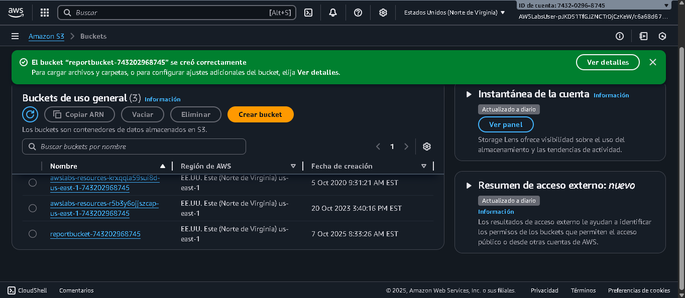
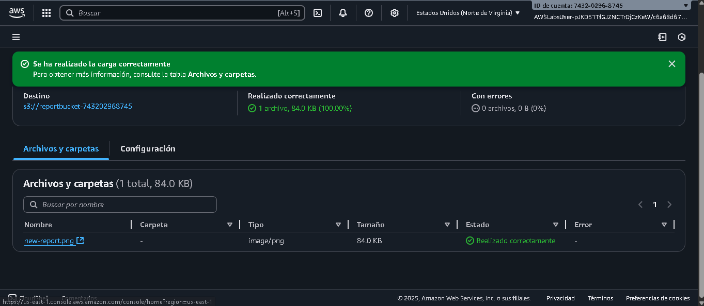
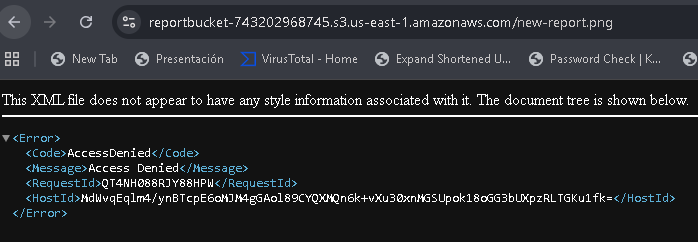
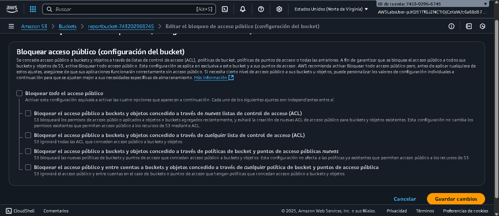
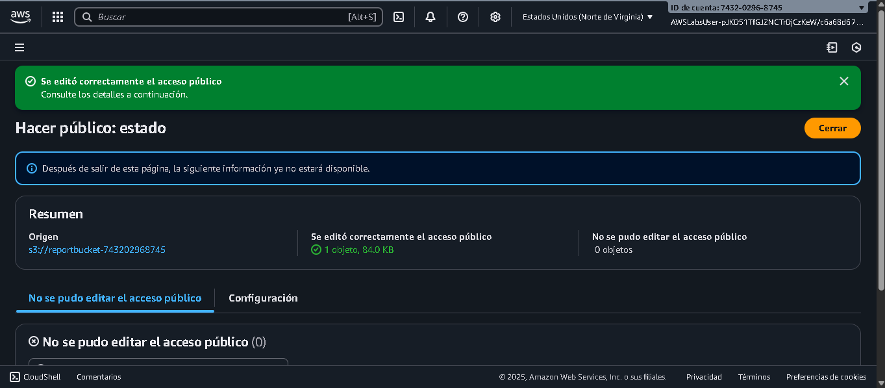
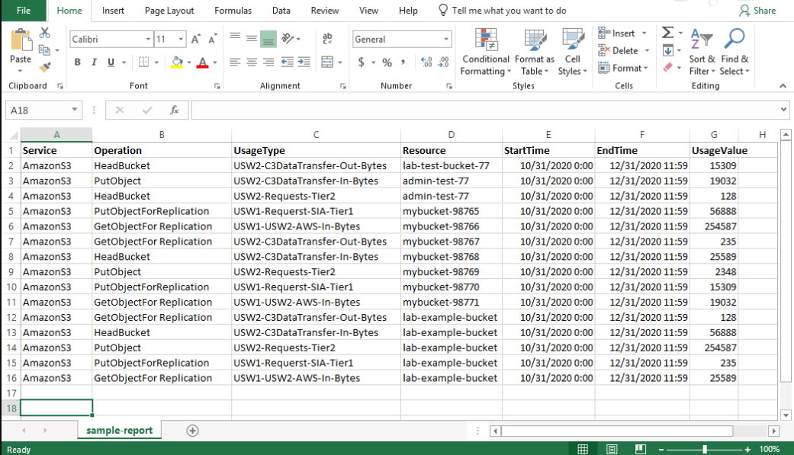
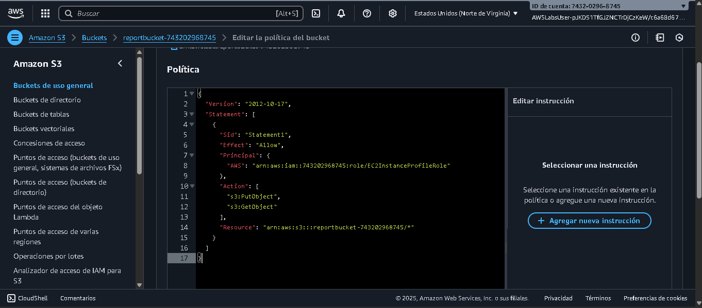
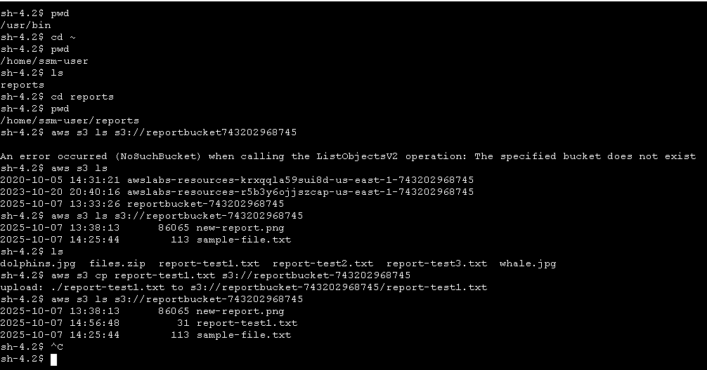
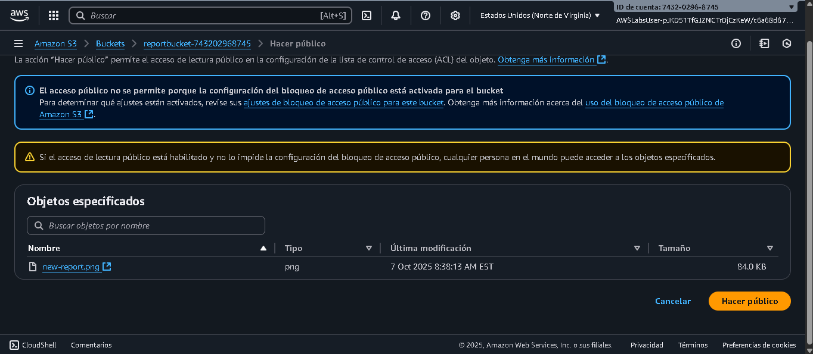

# 🧠 AWS Lab 3 – Introduction to Amazon S3 (Simple Storage Service)

## 🎯 Objetivos

Después de completar este laboratorio, podrás:

- Crear un bucket en Amazon S3.  
- Agregar objetos a un bucket.  
- Administrar permisos de acceso en objetos y buckets.  
- Crear una política de bucket.  
- Usar el control de versiones de bucket.  

---

## 🧩 Escenario del Laboratorio

Trabajas en una empresa que utiliza **Amazon S3** para almacenar datos.  
Una aplicación que corre en una instancia **EC2** debe enviar informes diarios a un bucket S3.

Tu tarea es configurar el bucket para:

- Permitir que la instancia EC2 pueda leer y escribir.  
- Mantener los objetos protegidos contra eliminación accidental.  
- Validar la seguridad y los permisos públicos.

---

## 🧱 Tarea 1: Crear un Bucket

1. En la consola de AWS, abre **S3** y selecciona **Crear bucket**.  
2. Asigna el nombre: reportbucket-<tu-ID-de-cuenta>
Ejemplo: `reportbucket-743202968745`
3. Habilita las **ACLs** y selecciona **Escritor de objetos**.  
4. Deja la región predeterminada.  
5. Selecciona **Crear bucket**.

**📸 Captura:**  

---

## 📤 Tarea 2: Cargar un Objeto

1. Descarga el archivo `new-report.png`.  
2. Abre el bucket `reportbucket-xxxxxx` en la consola de S3.  
3. Elige **Cargar → Agregar archivos** y selecciona `new-report.png`.  
4. Haz clic en **Cargar**.

**📸 Captura:**  

---

## 🔒 Tarea 3: Hacer que un Objeto sea Público

1. En la pestaña **Objetos**, selecciona `new-report.png`.  
2. Copia la **URL del objeto** (debería parecerse a `https://reportbucketXXXX.s3.amazonaws.com/new-report.png`).  
3. Pégala en el navegador → muestra **Acceso denegado**.

**📸 Captura:**  

4. Vuelve al bucket y ve a **Permisos → Bloquear acceso público → Editar**.  
5. Desactiva **Bloquear todo el acceso público** y guarda cambios.  
6. Vuelve al objeto y selecciona **Acciones → Hacer público mediante ACL**.

**📸 Captura:**  

7. Refresca el enlace en el navegador — ahora deberías ver la imagen correctamente.

---

## 💻 Tarea 4: Probar Conectividad desde EC2

1. En la consola, abre **EC2 → Instancias → Bastion Host → Conectar → Administrador de sesiones**.  
2. Ejecuta:
    cd ~
    pwd

Resultado esperado:
    /home/ssm-user

3. Lista todos los buckets:
    aws s3 ls

4. Lista objetos dentro de tu bucket:
    aws s3 ls s3://reportbucket743202968745

5. Cambia al directorio /home/ssm-user/reports y lista los archivos:
    cd reports
    ls

6. Intenta copiar un archivo hacia S3:
    aws s3 cp report-test1.txt s3://
    Resultado: Error (sin permisos aún).

**📸 Captura:**  

## 💻 Tarea 5: Crear una Política de Bucket

1. Ve a IAM → Roles → EC2InstanceProfileRole y copia su ARN.
    Ejemplo:
    arn:aws:iam::743202968745:role/EC2InstanceProfileRole

2. Ve a S3 → reportbucket → Permisos → Política de bucket → Editar.

3. En el Generador de políticas, selecciona:

    Tipo: S3 Bucket Policy
    Efecto: Allow
    Principal: el ARN del rol EC2
    Acciones: s3:GetObject, s3:PutObject
    Recurso: arn:aws:s3:::reportbucket743202968745/*

4. Genera y copia la política JSON:
{
  "Version": "2012-10-17",
  "Statement": [
    {
      "Effect": "Allow",
      "Principal": {
        "AWS": "arn:aws:iam::743202968745:role/EC2InstanceProfileRole"
      },
      "Action": ["s3:GetObject", "s3:PutObject"],
      "Resource": "arn:aws:s3:::reportbucket743202968745/*"
    },
    {
      "Effect": "Allow",
      "Principal": "*",
      "Action": "s3:GetObject",
      "Resource": "arn:aws:s3:::reportbucket743202968745/*"
    }
  ]
}

5. Guarda la política.

6. En EC2, vuelve a ejecutar:
    aws s3 cp report-test1.txt s3://reportbucket743202968745

Resultado esperado: Carga exitosa.

**📸 Captura:**  

## 💻 Tarea 6: Habilitar y Probar el Control de Versiones

1. En tu bucket reportbucket, abre Propiedades → Control de versiones → Editar → Habilitar.

2. Carga nuevamente un archivo con el mismo nombre sample-file.txt (contenido distinto).

3. En el navegador, abre el enlace y actualiza — ahora verás el nuevo contenido.

4. En la consola, selecciona Mostrar versiones para ver ambas versiones.

📸 Captura:

5. Elimina el objeto sample-file.txt.

    Confirma escribiendo delete.

    Observa que se genera un marcador de eliminación.

Habilita Mostrar versiones, selecciona el marcador y elimínalo.

Confirma escribiendo permanently delete.

El objeto se restaura correctamente.

🧩 Ejemplo de Política Extendida con versiones:
    {
  "Version": "2012-10-17",
  "Statement": [
    {
      "Action": ["s3:GetObject", "s3:GetObjectVersion"],
      "Effect": "Allow",
      "Resource": "arn:aws:s3:::reportbucket743202968745/*",
      "Principal": "*"
    }
  ]
}

🧠 Resumen del Laboratorio

✅ Creaste un bucket S3 y cargaste objetos.

✅ Probaste los permisos de acceso (privado/público).

✅ Configuraste una política para acceso EC2 + lectura pública.

✅ Probaste la carga (PutObject) y descarga (GetObject) desde EC2.

✅ Activaste el control de versiones y restauraste un objeto eliminado.

Resultado: Entorno S3 funcional, con control de acceso y protección contra eliminaciones accidentales. 🚀