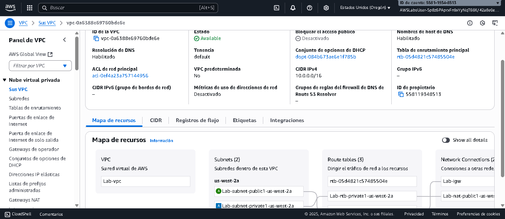
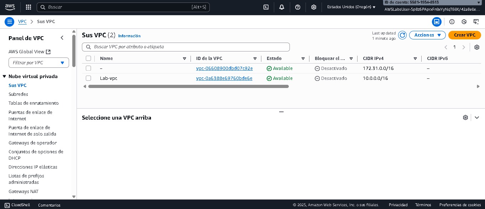
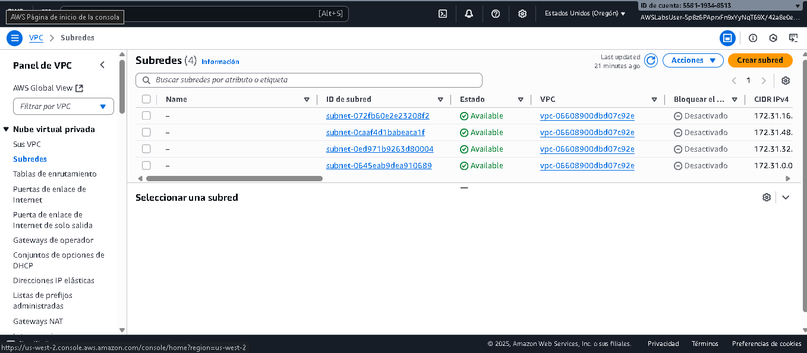
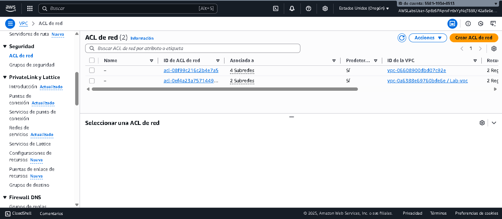
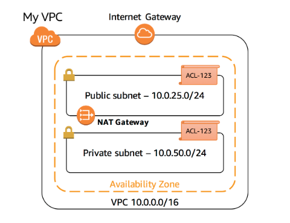

# Laboratorio: Amazon Virtual Private Cloud (Amazon VPC)

**Plataforma:** AWS Skill Builder – Builder Labs  
**Fecha:** 2025-10-01  
**Duración estimada:** ~60 minutos  
**Nivel:** Básico / Introductorio  

---

## 📌 Información general  
En este laboratorio se presenta **Amazon Virtual Private Cloud (Amazon VPC)**.  
Se utilizó el asistente de Amazon VPC para:  

- Crear una VPC.  
- Adjuntar una puerta de enlace de Internet.  
- Agregar una subred.  
- Definir el enrutamiento de la VPC, permitiendo que el tráfico fluya entre la subred y la puerta de enlace de Internet.  

---

## 🎯 Objetivos de aprendizaje  
Al finalizar este laboratorio, se pudo:  

1. Crear una Amazon VPC mediante el uso del asistente de la VPC.  
2. Explorar los componentes básicos de una VPC, incluyendo:  
   - Subredes públicas y privadas.  
   - Tablas de enrutamiento y rutas.  
   - Puertas de enlace NAT.  
   - Listas de control de acceso a la red (ACLs).  

---

## 🛠️ Tarea 1: Crear una Amazon VPC  

**Acciones realizadas:**  
- En la consola de AWS, busqué el servicio **VPC**.  
- Seleccioné **Crear VPC** y la opción **VPC y más**.  
- Configuración definida:  
  - Nombre automático: `Lab`.  
  - Zonas de disponibilidad: `1`.  
  - Subred pública: `1`.  
  - Subred privada: `1`.  
  - CIDR subred pública: `10.0.25.0/24`.  
  - CIDR subred privada: `10.0.50.0/24`.  
  - NAT Gateway: `En 1 AZ`.  
  - Endpoints: `Ninguno`.  
- Se creó la VPC y copié el **ID de la VPC** para usarlo más adelante.  

**Evidencias:**  
-   
-   

**Resultado:**  
La VPC quedó lista con una subred pública y otra privada configuradas.  

---

## 🔎 Tarea 2: Explorar la VPC  

### 1. Sus VPC  
- Confirmé la creación de la VPC con nombre **lab-vpc**.  

  

---

### 2. Puerta de enlace de Internet (IGW)  
- Verifiqué la puerta de enlace de Internet asociada a la VPC.  

📌 **Nota:** La puerta de enlace conecta la VPC con Internet, es redundante y altamente disponible.  

  

---

### 3. Subredes  
- Identifiqué la subred pública `Lab-subnet-public`.  
- Configuración:  
  - CIDR: `10.0.25.0/24`.  
  - 250 IPs disponibles (de 256).  
  - Se considera **pública** por su tabla de enrutamiento hacia la IGW.  

  

---

### 4. Tabla de enrutamiento  
- Confirmé que la tabla de enrutamiento dirige el tráfico de la subred pública hacia la IGW.  

  

---

### 5. ACL de red  
- Revisé las reglas predeterminadas de entrada y salida en la ACL asociada.  

  

---

### 6. Grupos de seguridad  
- Revisé el grupo de seguridad asociado al ID de la VPC.  
- **Reglas de entrada:** solo permite tráfico desde el mismo SG (autorreferencia).  

📌 **Nota:** Esto asegura que instancias en el mismo SG puedan comunicarse entre sí, bloqueando el resto del tráfico.  

  

---

## ✅ Resultado final  
- VPC creada con subred pública y privada.  
- Componentes principales configurados: IGW, NAT, tablas de enrutamiento, ACL y SG.  
- Verificación realizada con capturas de consola.  

  

---

## 📚 Evidencias adicionales  
- **Prueba final completada:** 5/5 respuestas correctas ✔️  

---

## 💭 Reflexión personal  
Este laboratorio permitió comprender cómo se estructura una **VPC desde cero**, incluyendo conectividad a Internet y segmentación de subredes.  
Es un paso clave para entender la arquitectura de redes en AWS y servirá de base para escenarios más avanzados de **seguridad en la nube**.  

---