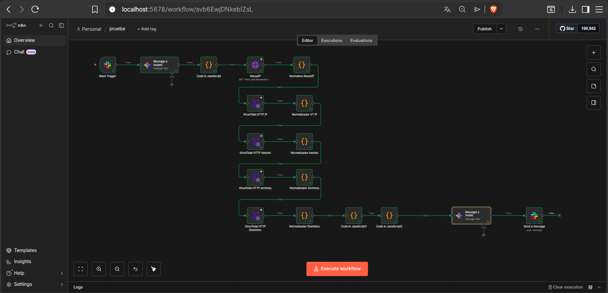
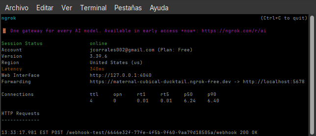

# 🤖 SOAR Automation with n8n

## Overview

This project documents the development of a SOAR-style automation workflow built with n8n.

The workflow automates the initial analysis of security alerts by extracting IOCs from raw logs, enriching them with threat intelligence sources, mapping MITRE ATT&CK techniques, and generating a structured incident report delivered directly to Slack.

The primary goal was to reduce repetitive Tier 1 SOC analyst tasks and accelerate the triage process.

---

## Objective

Build an automated workflow capable of:

- Receiving security logs through Slack
- Extracting IOCs from any log format
- Enriching indicators using multiple intelligence sources
- Mapping MITRE ATT&CK techniques
- Assessing severity
- Delivering actionable recommendations

The workflow was designed to be source-agnostic, allowing it to process logs from Wazuh, Let'sDefend, Palo Alto, and other platforms.

---

## Architecture

<p align="center">
  
</p>

### Workflow

```text
Slack Trigger
      ↓
Gemini IOC Extraction
      ↓
Data Normalization
      ↓
AbuseIPDB Enrichment
      ↓
VirusTotal Enrichment
      ↓
AI Threat Analysis
      ↓
Slack Report Delivery
```

The final workflow consists of 13 sequential nodes designed for stability and predictable execution. 

---

## Technology Stack

| Component | Purpose |
|------------|----------|
| n8n | SOAR Platform |
| Slack | Input & Output Channel |
| ngrok | Public Tunnel for Webhooks |
| Gemini 2.0 Flash | IOC Extraction & Threat Analysis |
| AbuseIPDB | IP Reputation |
| VirusTotal | IOC Enrichment |
| JavaScript | Data Normalization |
---

## External Connectivity Challenge

One of the main implementation challenges was enabling Slack to communicate with a locally hosted n8n instance.

Since n8n was running on a homelab environment and exposed only through localhost, Slack webhooks could not directly reach the workflow endpoint.

To solve this issue, ngrok was used to create a secure public tunnel between the Internet and the local n8n instance.

<p align="center">
  
</p>

### Benefits

* Allowed Slack Event Subscriptions to reach local workflows.
* Enabled external webhook testing without deploying to a public server.
* Simplified development and validation of the SOAR workflow.

### Architecture

```text
Slack
   ↓
Internet
   ↓
ngrok Tunnel
   ↓
Local n8n Instance
   ↓
SOAR Workflow
```

This approach enabled end-to-end testing while maintaining the workflow within the local homelab environment.


---

## Key Features

### IOC Extraction with AI

Gemini receives the raw log and extracts:

- IP addresses
- Domains
- URLs
- Hashes
- CVEs
- Commands
- Usernames
- Hostnames

This allows the workflow to process multiple log formats without custom parsers.

### Threat Intelligence Enrichment

The workflow automatically queries:

- AbuseIPDB
- VirusTotal

and consolidates reputation data, detections, malicious engines, and related intelligence.

### MITRE ATT&CK Mapping

The final AI analysis maps observed activity to relevant ATT&CK techniques and tactics while generating recommended response actions.

### Automated Reporting

A professional incident report is delivered directly to Slack, eliminating manual formatting and accelerating analyst response.

---

## Validation Results

### Scenario 1 – Living-off-the-Land Attack

Results:

- Identified regsvr32 abuse
- Detected Microsoft typosquatting domain
- Confirmed malicious hash detection through VirusTotal
- Classified severity as Critical
- Generated response recommendations
- Mapped relevant MITRE ATT&CK techniques

### Scenario 2 – CVE-2024-3400

Results:

- Identified CVE exploitation
- Detected command injection indicators
- Detected path traversal behavior
- Generated MITRE ATT&CK mappings
- Produced automated incident report


---

## Lessons Learned

- Sequential workflows proved more reliable than parallel branches.
- Explicit node references improved workflow stability.
- AI-based IOC extraction removed dependency on log-specific parsers.
- Error handling is essential when working with external intelligence APIs.
- SOAR automation can significantly reduce manual triage workload.


---

## Skills Demonstrated

- Security Automation
- SOAR Concepts
- Threat Intelligence Enrichment
- IOC Analysis
- MITRE ATT&CK Mapping
- Workflow Design
- API Integration
- JavaScript
- Incident Triage

---

## Portfolio Case Study

Full interactive documentation:
https://jcorrales02.github.io/Jcorrales-Web/case-files/home-lab-soar-n8n.html
