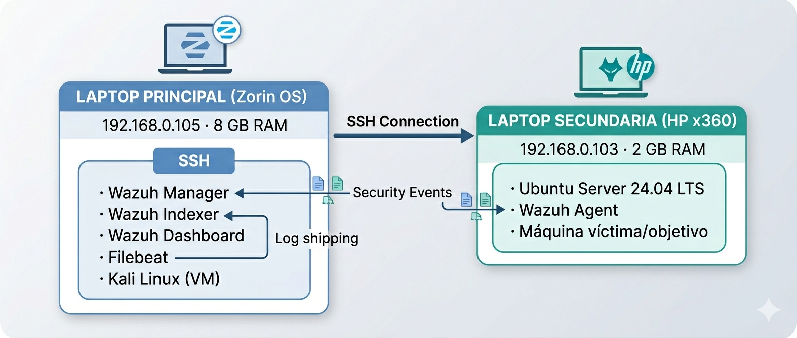

# 🛡️ Wazuh SIEM Homelab on Limited Hardware

## Overview

This project documents the deployment of a fully functional Wazuh SIEM environment using repurposed hardware and open-source tools.

The goal was to build a realistic SOC lab capable of collecting logs, detecting security events, and correlating alerts with MITRE ATT&CK despite significant hardware limitations.

## Lab Summary

| Category | Value |
|-----------|--------|
| Date | May 2026 |
| Type | Home Lab |
| SIEM | Wazuh 4.7.5 |
| OS | Ubuntu Server 24.04 |
| Monitoring | Wazuh Agent |
| Additional Tools | Kali Linux, SSH, VirtualBox |
| Result | Operational SIEM with real-time detection |

---

## Challenge

Instead of using cloud infrastructure or enterprise hardware, this lab was built using two old laptops:

- Main workstation running Zorin OS
- Secondary laptop running Ubuntu Server
- Limited memory available
- No dedicated server hardware

The objective was to achieve enterprise-style visibility using minimal resources.

---

## Architecture
  

---

## Implementation Highlights

### Ubuntu Server Deployment

- Ubuntu Server installed on secondary laptop
- SSH configured for remote administration
- Static IP assignments configured on local network

### Wazuh Deployment

- Wazuh deployed using the official all-in-one installer
- Manager, Indexer, Dashboard and Filebeat installed
- Agent enrolled and connected successfully

### Detection Validation

A brute-force SSH attack was launched from Kali Linux using Hydra.

The SIEM successfully detected:

- 416+ authentication events
- PAM authentication activity
- MITRE ATT&CK mapping
- Compliance framework references
- Alert severity classification

---

## Problems Encountered

### Checksum Verification Failures

Installation media repeatedly failed validation.

**Root Cause:** Unstable microSD-to-USB adapter.

**Solution:** Recreated installation media using a dedicated USB drive.

---

### Resource Constraints

Wazuh components consumed most available RAM.

**Solution:**

- Increased swap space
- Managed services manually
- Stopped non-essential services during attack simulations

---

### Alert Visibility Issues

Alerts existed in logs but were not reaching the dashboard.

**Solution:**

- Reinstalled using the official installer
- Corrected component integration
- Restored Filebeat communication

---

## Key Lessons Learned

- Official installers save significant troubleshooting time.
- Infrastructure troubleshooting is part of SOC operations.
- Resource management is an operational skill.
- SSH dramatically improves lab administration.
- Wazuh provides extensive MITRE ATT&CK correlation out of the box.
- Effective security labs can be built without expensive hardware.

---

## Skills Demonstrated

- SIEM Deployment
- Security Monitoring
- Alert Analysis
- Linux Administration
- Troubleshooting
- Network Configuration
- Incident Detection
- MITRE ATT&CK Mapping

---

## Portfolio Case Study

Full interactive case study:

https://jcorrales02.github.io/Jcorrales-Web/case-files/home-lab-wazuh.html
