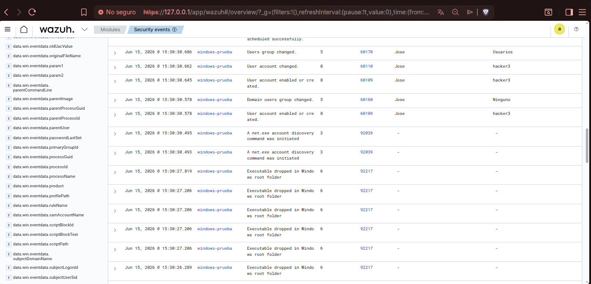

# CASE-W02 — Creación de Usuario Local Malicioso

**Campaña:** Windows Endpoint Attack Simulation — Fase 2 de 9  
**Fecha:** 15 de junio de 2026  
**Plataforma:** Home Lab — Wazuh 4.7.5 + Sysmon v15.20  
**Severidad:** 🔴 High  

---

## Resumen

Simulación de creación de cuenta local maliciosa en endpoint Windows 10. El usuario hacker3 fue creado via net.exe, agregado al grupo Administradores para escalada de privilegios, y eliminado para cubrir rastros. Wazuh capturó el ciclo completo en menos de 4 minutos. Mapeado a MITRE ATT&CK T1136.001, T1098 y T1531.

---

## Infraestructura del Lab

| Componente | Detalle |
|---|---|
| Wazuh Manager | Zorin OS — 192.168.0.105 |
| Agente (víctima) | Windows 10 Home — DESKTOP-CC2O1S4 — 192.168.0.103 |
| Vector de acceso | SSH — PowerShell remoto |
| SIEM | Wazuh 4.7.5 |
| EDR | Sysmon v15.20 (config SwiftOnSecurity) |

---

## Evidencia Visual



*Fig. 1 — Dashboard Wazuh con eventos filtrados. Se observan reglas 60109, 60154, 60111 y actividad de discovery via net.exe (92031, 92039).*

---

## Tabla de Evidencia

| Timestamp | Regla Wazuh | Nivel | Sujeto | Objetivo | Descripción |
|---|---|---|---|---|---|
| 15:30:30.578 | 60109 | 8 | Jose | hacker3 | User account enabled or created |
| 15:30:30.578 | 60160 | 5 | Jose | Ninguno | Domain users group changed |
| 15:30:30.645 | 60109 | 8 | Jose | hacker3 | User account enabled or created (habilitación) |
| 15:30:30.662 | 60110 | 8 | Jose | hacker3 | User account changed |
| 15:30:30.686 | 60170 | 5 | Jose | Usuarios | Users group changed |
| **15:33:25.909** | **60154** | **12** | **Jose** | **Administradores** | **⚠ Administrators group changed — escalada de privilegios** |
| 15:33:25.910 | 92031 | 3 | — | — | Discovery activity executed (net.exe) |
| 15:33:54.493 | 92039 | 3 | — | — | net.exe account discovery command initiated |
| 15:33:55.416 | 60154 | 12 | Jose | Administradores | ⚠ Administrators group changed — segundo registro |
| 15:33:55.418 | 60170 | 5 | Jose | Usuarios | Users group changed |
| **15:33:56.111** | **60111** | **8** | **Jose** | **hacker3** | **User account disabled or deleted — cuenta eliminada** |
| 15:33:56.111 | 60160 | 5 | Jose | Ninguno | Domain users group changed — limpieza post-eliminación |

---

## Timeline del Ataque

```
15:30:30.578   Cuenta hacker3 creada por jose
                Regla 60109 nivel 8 — net user hacker3 /add

15:30:30.662   Cuenta modificada y agregada a grupo Usuarios
                Reglas 60110, 60170

15:33:25.909   ⚠ hacker3 agregado al grupo Administradores
                Regla 60154 nivel 12 — escalada de privilegios
                net localgroup Administradores hacker3 /add

15:33:25 - 27  Discovery post-escalada via net.exe
                Reglas 92031, 92039 — enumeración de cuentas y grupos

15:33:41 - 42  Ruido de sistema — Windows Update (falso positivo)
                Regla 92217 — mousocoreworker.exe — descartado

15:33:56.111   Cuenta hacker3 eliminada — intento de cubrir rastros
                Regla 60111 nivel 8 — net user hacker3 /delete
```

---

## Ruido Identificado — Falso Positivo

> **Regla 92217 — Executable dropped in Windows root folder (9 eventos)**  
> Generado por `mousocoreworker.exe` creando DLLs en `C:\Windows\SoftwareDistribution\Download\...`.  
> Proceso legítimo de Windows Update (NT AUTHORITY\SYSTEM). Descartado como falso positivo.  
> En producción se suprimiría esta regla para esa ruta específica.

---

## MITRE ATT&CK Mapping

| Táctica | Técnica | ID | Descripción |
|---|---|---|---|
| Persistence | Create Account: Local Account | T1136.001 | net user hacker3 /add |
| Privilege Escalation | Account Manipulation | T1098 | Agregado al grupo Administradores |
| Impact | Account Access Removal | T1531 | Eliminación de cuenta para cubrir rastros |
| Discovery | Account Discovery: Local Account | T1087.001 | net.exe enumerando cuentas y grupos |
| Defense Evasion | Indicator Removal | T1070 | Eliminación de cuenta post-uso |

---

## IOCs

| Tipo | Valor | Contexto |
|---|---|---|
| Usuario | hacker3 | Cuenta local maliciosa creada para persistencia |
| Grupo | Administradores | Grupo objetivo para escalada de privilegios |
| Proceso | net.exe | LOLBin usado para creación de usuario y discovery |
| SID | S-1-5-21-...-1006 | SID asignado a hacker3 en DESKTOP-CC2O1S4 |
| Sujeto | jose / S-1-5-21-...-1001 | Cuenta comprometida usada para ejecutar las acciones |

---

## Acciones Tomadas

**Detección:** Wazuh generó alerta nivel 12 (60154) al detectar modificación del grupo Administradores. Alertas nivel 8 para creación (60109) y eliminación (60111) de cuenta.

**Análisis:** Se correlacionaron los eventos de creación, escalada y eliminación por timestamp y sujeto ejecutor. La secuencia crear → escalar → eliminar es un patrón clásico de persistencia encubierta. La eliminación de la cuenta no borra los logs de auditoría.

**Contención simulada:**
```powershell
# Verificar usuarios locales actuales
Get-LocalUser

# Verificar miembros del grupo Administradores
Get-LocalGroupMember -Group "Administradores"

# Eliminar cuenta maliciosa si persiste
net user hacker3 /delete

# Revisar cuentas creadas recientemente en Event Log
Get-WinEvent -FilterHashtable @{LogName='Security'; Id=4720} | `
  Select-Object TimeCreated, Message | Format-List
```

---

## Lecciones Aprendidas

1. La regla Wazuh 60154 (Administrators group changed) con nivel 12 es una de las alertas de mayor prioridad en un endpoint Windows — cualquier modificación al grupo Administradores debe investigarse inmediatamente.
2. Eliminar una cuenta local no borra los eventos del Security Log. Los registros quedan con el SID original, permitiendo reconstruir la actividad completa.
3. net.exe es un LOLBin — herramienta legítima de Windows usada frecuentemente por atacantes. Sysmon la detectó via reglas 92031 y 92039, demostrando la importancia de monitorear ejecución de procesos.
4. Durante el análisis se identificó ruido legítimo (92217 — Windows Update) que podría confundir a un analista sin experiencia. Distinguir actividad de sistema de actividad maliciosa es crítico en un SOC.
5. La secuencia crear → escalar → eliminar en menos de 4 minutos es un patrón de alta sospecha. En producción, una regla de correlación temporal entre 4720 y 4726 con un 4732 intermedio debería generar alerta automática de alta prioridad.

---

## Campaña — Windows Endpoint Attack Simulation

| Case | Título | Estado |
|---|---|---|
| W01 | SSH Brute Force & Account Lockout | ✅ Completado |
| **W02** | **Creación de Usuario Local Malicioso** | ✅ Completado |
| W03 | Ejecución de PowerShell | 🔄 Pendiente |
| W04 | Elevación de Privilegios | 🔄 Pendiente |
| W05 | Descarga de Archivos | 🔄 Pendiente |
| W06 | Persistencia — Registry Run Keys | 🔄 Pendiente |
| W07 | Escaneo de Puertos desde Kali | 🔄 Pendiente |
| W08 | Conexiones RDP | 🔄 Pendiente |
| W09 | Ejecución de PsExec / WMI | 🔄 Pendiente |
