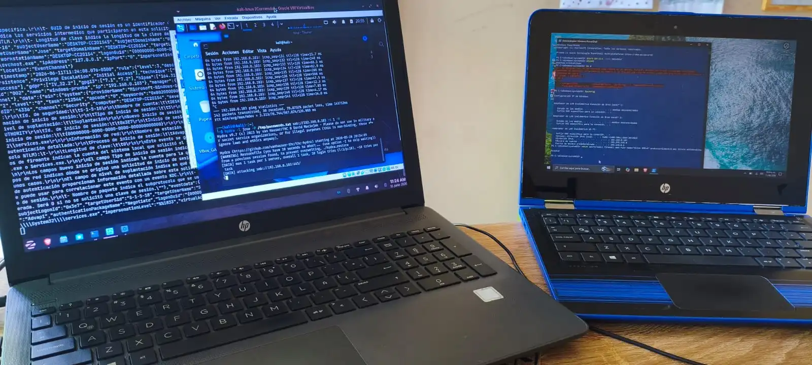

# CASE-W01 — SSH Brute Force & Account Lockout

**Campaña:** Windows Endpoint Attack Simulation — Fase 1 de 9  
**Fecha:** 11 de junio de 2026  
**Plataforma:** Home Lab — Wazuh 4.7.5 + Sysmon v15.20  
**Severidad:** 🔴 High  

---

## Resumen

Ataque de fuerza bruta SSH simulado con Hydra desde Kali Linux contra endpoint Windows 10. Múltiples Event 4625 en 11 segundos, bloqueo de cuenta (Event 4740) detectado por Wazuh. Correlación de IP atacante via canal OpenSSH/Operational. Mapeado a MITRE ATT&CK T1110.001 y T1531.

---

## Infraestructura del Lab

| Componente | Detalle |
|---|---|
| Wazuh Manager | Zorin OS — 192.168.0.105 |
| Agente (víctima) | Windows 10 Home — DESKTOP-CC2O1S4 — 192.168.0.103 |
| Atacante | Kali Linux — 192.168.0.108 |
| SIEM | Wazuh 4.7.5 |
| EDR | Sysmon v15.20 (config SwiftOnSecurity) |

---

## Evidencia Visual



*Fig. 1 — Captura en tiempo real del ataque. Izquierda: Wazuh tail mostrando eventos 4625. Centro: Hydra corriendo en Kali Linux. Derecha: PowerShell en la máquina víctima.*

---

## Tabla de Evidencia

| Timestamp | Event ID | Regla Wazuh | Nivel | Descripción |
|---|---|---|---|---|
| 20:32:27.869 | 4625 | 60122 | 5 | Logon failure — inicio del ataque masivo |
| 20:32:27.883 | 4625 | 60122 | 5 | Logon failure — intentos consecutivos (Hydra) |
| 20:32:27.899 | 4625 | 60122 | 5 | Logon failure — intentos consecutivos (Hydra) |
| 20:32:27.916 | 4625 | 60122 | 5 | Logon failure — intentos consecutivos (Hydra) |
| 20:32:27.931 | 4625 | 60122 | 5 | Logon failure — intentos consecutivos (Hydra) |
| 20:32:27.950 | 4625 | 60122 | 5 | Logon failure — intentos consecutivos (Hydra) |
| **20:32:28.856** | **4740** | **60115** | **9** | **⚠ Cuenta bloqueada — umbral de fallos superado** |
| 20:32:28.868 | 4625 | 60122 | 5 | Logon failure — intentos continúan post-lockout |
| 20:32:36.478 | 4624 | 60106 | 3 | Login exitoso — Logon Type 3, usuario jose, sshd.exe |
| 20:32:37.299 | 4625 | 60122 | 5 | Logon failure — último intento registrado |

---

## Timeline del Ataque

```
20:32:26 — 20:32:27   Sesión SSH legítima activa (Zorin → Windows)
                       4624 Logon Type 3 — usuario jose — sshd.exe

20:32:27.869          Inicio del ataque de fuerza bruta (Kali → Windows)
                       Múltiples 4625 consecutivos — Hydra via SSH puerto 22
                       subStatus: 0xC0000064 / 0xC000006A

20:32:28.856          ⚠ LOCKOUT — Event 4740
                       Wazuh regla 60115 nivel 9
                       Cuenta jose bloqueada por Windows

20:32:28 — 20:32:37   Hydra continúa post-lockout
                       4625 siguen registrándose

20:32:36.478          4624 Logon Type 3 — login exitoso
                       Sesión SSH preexistente de Zorin (no del atacante)
```

---

## MITRE ATT&CK Mapping

| Táctica | Técnica | ID | Descripción |
|---|---|---|---|
| Credential Access | Brute Force: Password Guessing | T1110.001 | Hydra con diccionario contra SSH |
| Initial Access | Valid Accounts | T1078 | Objetivo: cuenta local jose |
| Impact | Account Access Removal | T1531 | Lockout de cuenta por volumen de fallos |
| Discovery | Network Service Discovery | T1046 | Puerto 22 expuesto y accesible |

---

## IOCs

| Tipo | Valor | Contexto |
|---|---|---|
| IP | 192.168.0.108 | IP atacante — Kali Linux |
| Puerto | TCP/22 | Servicio SSH expuesto en la víctima |
| Usuario | jose | Cuenta objetivo — bloqueada tras múltiples fallos |
| Proceso | sshd.exe | C:\Windows\System32\OpenSSH\sshd.exe |
| Status Code | 0xC000006D | Error de autenticación — credenciales inválidas |
| SubStatus | 0xC0000064 | Usuario no existe en el sistema |

---

## Acciones Tomadas

**Detección:** Wazuh generó alertas nivel 5 por múltiples 4625 consecutivos (regla 60122) y alerta nivel 9 por bloqueo de cuenta (regla 60115 — Event 4740).

**Análisis:** Se correlacionaron los eventos 4625, 4740 y 4624 por timestamp para reconstruir la secuencia del ataque. La IP fuente fue confirmada mediante el canal `OpenSSH/Operational` del Event Viewer en la máquina víctima.

**Contención simulada:**
```powershell
# Bloquear IP atacante via Windows Firewall
New-NetFirewallRule -DisplayName "Block Attacker" -Direction Inbound `
  -RemoteAddress 192.168.0.108 -Action Block

# Desbloquear cuenta tras investigación
net user jose /active:yes

# Revisar intentos desde OpenSSH Operational log
Get-WinEvent -LogName "OpenSSH/Operational" | `
  Where-Object {$_.Message -like "*192.168.0.108*"} | `
  Format-List TimeCreated, Message
```

---

## Limitación Técnica Identificada

> OpenSSH en Windows no popula el campo *Dirección de red de origen* en los eventos 4625 del Security Log, a diferencia de SMB o RDP. La atribución de IP atacante requiere fuentes adicionales: canal `OpenSSH/Operational`, logs de firewall perimetral, o NetFlow. Este es el comportamiento real del sistema, no una limitación del lab.

---

## Lecciones Aprendidas

1. Un volumen alto de Event 4625 en rango de segundos es el indicador primario de brute force, independientemente de si la IP fuente es visible en el log.
2. El Event 4740 es señal de alta confianza — confirma que el volumen de fallos superó el umbral configurado, lo que en producción requiere respuesta inmediata.
3. La atribución completa en un SIEM requiere correlación de múltiples fuentes. Depender exclusivamente del Security Log para obtener la IP atacante es insuficiente cuando el vector es SSH.
4. Windows Firewall bloqueaba ICMP por defecto, lo que inicialmente impedía la conectividad entre Kali y el endpoint. Un atacante real no dependería de ICMP — usaría directamente el puerto objetivo.

---

## Campaña — Windows Endpoint Attack Simulation

| Case | Título | Estado |
|---|---|---|
| **W01** | **SSH Brute Force & Account Lockout** | ✅ Completado |
| W02 | Creación de Usuarios Locales | 🔄 Pendiente |
| W03 | Ejecución de PowerShell | 🔄 Pendiente |
| W04 | Elevación de Privilegios | 🔄 Pendiente |
| W05 | Descarga de Archivos | 🔄 Pendiente |
| W06 | Persistencia — Registry Run Keys | 🔄 Pendiente |
| W07 | Escaneo de Puertos desde Kali | 🔄 Pendiente |
| W08 | Conexiones RDP | 🔄 Pendiente |
| W09 | Ejecución de PsExec / WMI | 🔄 Pendiente |
